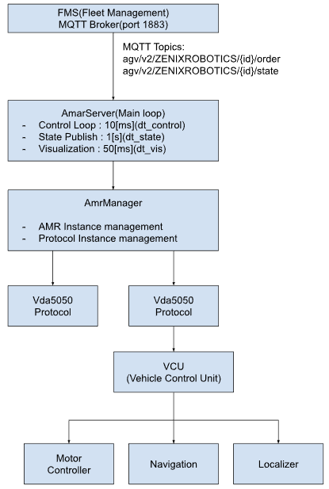
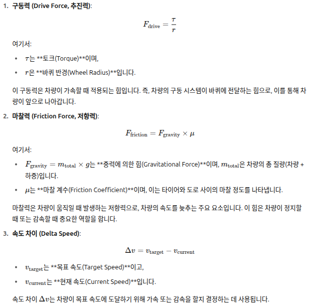
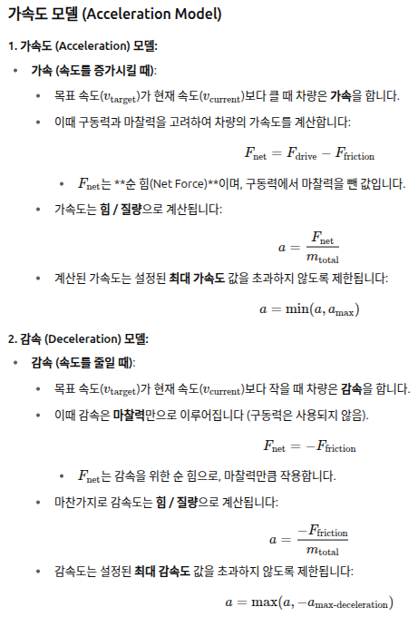
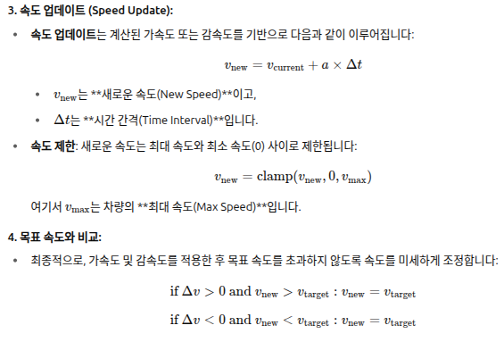
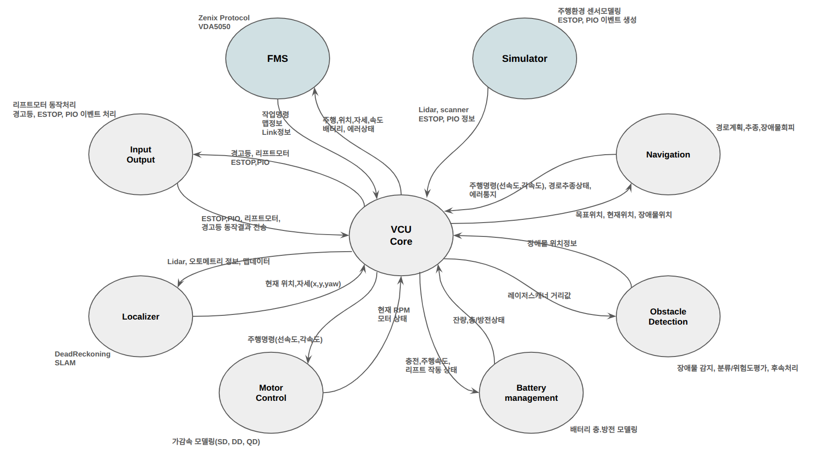
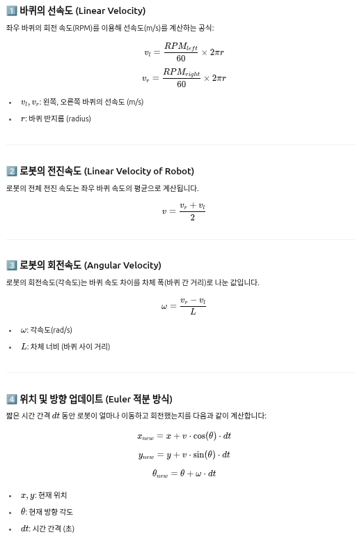
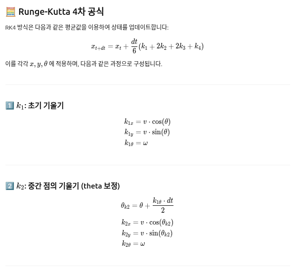
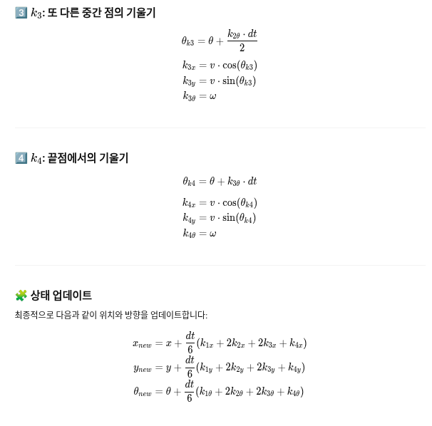

# 소개
AMR Emulator는 실제 AMR(Autonomous Mobile Robot) 하드웨어 없이 VDA5050 프로토콜 기반의 제어로직을 검증하기 위한 시뮬레이터


# 개발환경
 - protocol : VDA5050 2.0
 - 통신 : MQTT
 - 언어 : C++


# 주요기능
 - VDA5050 Order 수신 및 처리,State 발행(New/Update/Cancel)
 - Pure Pursuit 기반 경로 추종
 - Dead Reckoning 측위
 - 배터리 시뮬레이션
 - 다중 AGV 시뮬레이션 지원


# SW 구조



# Build 및 실행
- dependency
```
# Ubuntu 20.04/22.04
sudo apt install -y \
    build-essential \
    cmake \
    libyaml-cpp-dev \
    nlohmann-json3-dev \
    libpaho-mqtt-dev \
    libpaho-mqttpp-dev
```
- build
```
cd amr_emulator
mkdir build && cd build
cmake ..
make -j$(nproc)
```
- 빠른실행(오더 발행/주행/시각화)
```
cd amr_emulator
./run.sh
```


# 주요 코드 설명
- main.cpp - 엔트리 포인트
  - YAML 설정 파일 경로 로드
  - AmrServerApp 실행
```
int main(int argc, char* argv[]) 
{
    std::string config_path;
    if (argc > 1) config_path = argv[1];
    AmrServerApp app;
    app.run(config_path);
    return 0;
}
```

- amr_server.cpp - 메인 루프
  - Control Loop: Motor/Navigation 업데이트
  - State Publish: FMS로 State 발행
  - Visualization: 시각화 데이터 발행        
```
void AmrServerApp::run(const std::string& config_path)
{
    // 1. 설정 로드
    AmrConfig config = YamlConfig::load(config_path);
    
    // 2. AMR Manager 생성 및 시작
    AmrManager manager(config);
    manager.startAll();
    
    // 3. 시뮬레이션 타이밍 설정
    const double dt_control = config.control_period;      // 10ms
    const double dt_state = config.mqtt.state_publish_period;    // 1s
    const double dt_vis = config.mqtt.visualization_publish_period; // 50ms
    
    // 4. 메인 루프
    while (true)
    {
        // 4-1. 제어 주기 (10ms)
        if (sim_time >= next_motor_update) 
        {
            for (auto& amr : amrs)
            {
                // 배터리 업데이트
                amr->updateBattery(dt_control, is_charging);
                
                // 차량 업데이트 (Navigation + Motor)
                amr->step(dt_control, other_positions);
                
                // 노드 도착 이벤트 처리
                if (amr->needsImmediateStatePublish())
                {
                    protocol->publishStateMessage(amr.get());
                    amr->resetImmediateStatePublishFlag();
                }
            }
            next_motor_update += dt_control;
        }
        
        // 4-2. State 발행 (1s)
        if (sim_time >= next_state_pub) 
        {
            for (size_t i = 0; i < amrs.size(); ++i) 
            {
                protocol->publishStateMessage(amrs[i].get());
            }
            next_state_pub += dt_state;
        }
        
        // 4-3. Visualization 발행 (50ms)
        if (sim_time >= next_vis_pub) 
        {
            for (size_t i = 0; i < amrs.size(); ++i) 
            {
                protocol->publishVisualizationMessage(amrs[i].get());
            }
            next_vis_pub += dt_vis;
        }
        
        std::this_thread::sleep_for(...);
    }
}
```

- vda5050_protocol.cpp - VDA5050 프로토콜 핸들러
  - Order Merge 로직
```
  bool Vda5050Protocol::mergeOrder(const nlohmann::json& order_json)
{
    std::string new_order_id = order_json.value("orderId", "");
    int new_order_update_id = order_json.value("orderUpdateId", 0);
    
    // 1. Cancel Order (nodes=[], edges=[])
    if (nodes_json.empty() && edges_json.empty())
    {
        amr_->cancelOrder();
        publishStateMessage(amr_);
        return true;
    }
    
    // 2. New Order (orderId 변경)
    bool is_new_order = (new_order_id != current_order_id_);
    if (is_new_order)
    {
        // 기존 Order 취소
        amr_->cancelOrder();
        
        // 새 Order 파싱
        parseOrderNodes(order_json["nodes"]);
        parseOrderEdges(order_json["edges"]);
        
        // Start Node Position 검증
        validateStartNodePosition(...);
        
        // AMR에 전달
        amr_->setOrder(received_nodes_, received_edges_, ...);
        
        order_active_ = true;
        publishStateMessage(amr_);
    }
    
    // 3. Update Order (orderUpdateId 증가)
    if (new_order_update_id > current_order_update_id_)
    {
        // sequenceId 기반 Merge
        mergeNodesAndEdges();
        publishStateMessage(amr_);
    }
    
    return true;
}
```
  - State Message 생성
```
std::string Vda5050Protocol::makeStateMessage(IAmr* amr)
{
    json state;
    
    // Header
    state["headerId"] = state_header_id_++;
    state["timestamp"] = getCurrentTimestampISO8601();
    state["version"] = "2.0.0";
    state["manufacturer"] = "ZENIXROBOTICS";
    state["serialNumber"] = agv_id_;
    
    // Order Info
    state["orderId"] = current_order_id_;
    state["orderUpdateId"] = current_order_update_id_;
    
    // Node States (upcoming nodes만)
    state["nodeStates"] = getUpcomingNodes(amr);
    
    // Edge States (upcoming edges만)
    state["edgeStates"] = getUpcomingEdges(amr);
    
    // AGV Position
    double x, y, theta;
    amr->getVcu()->getEstimatedPose(x, y, theta);
    state["agvPosition"] = {
        {"x", x}, {"y", y}, {"theta", theta},
        {"mapId", "default_map"}
    };
    
    // Battery
    state["batteryState"]["batteryCharge"] = amr->getBatterySoc();
    
    // Driving
    state["driving"] = order_active_;
    
    return state.dump();
}
```


- amr.cpp - AMR 인스턴스
  - Order 설정
```
void Amr::setOrder(const std::vector<NodeInfo>& nodes, 
                   const std::vector<EdgeInfo>& edges,
                   const std::vector<NodeInfo>& all_nodes,
                   double lookahead_distance)
{
    ordered_nodes_ = nodes;
    ordered_edges_ = edges;
    all_nodes_for_state_ = all_nodes;
    
    current_node_index_ = 0;
    current_edge_index_ = 0;
    order_active_ = true;
    
    std::cout << "[AMR] New order set: " << nodes.size() 
              << " nodes, " << edges.size() << " edges" << std::endl;
}
```
  - Step 실행(메인 업데이트)
```
void Amr::step(double dt, const std::vector<std::pair<double,double>>& other_positions)
{
    if (!order_active_ || ordered_nodes_.empty()) {
        vcu_->Idle(dt);
        return;
    }
    
    // 현재 Node/Edge 가져오기
    const NodeInfo& target_node = ordered_nodes_[current_node_index_];
    const EdgeInfo* current_edge = getCurrentEdge();
    
    // VCU에 목표 위치 설정
    if (!target_set_for_current_node_)
    {
        double start_x, start_y, start_theta;
        vcu_->getEstimatedPose(start_x, start_y, start_theta);
        
        vcu_->setTargetPosition(
            start_x, start_y, start_theta,
            target_node.x, target_node.y,
            current_edge->turnCenterX,
            current_edge->turnCenterY,
            current_edge->hasTurnCenter,
            wheel_base_
        );
        
        target_set_for_current_node_ = true;
    }
    
    // VCU 업데이트 (Navigation + Motor)
    vcu_->update(dt, other_positions);
    
    // 노드 도착 체크
    double current_x, current_y, current_theta;
    vcu_->getEstimatedPose(current_x, current_y, current_theta);
    
    double dx = target_node.x - current_x;
    double dy = target_node.y - current_y;
    double distance = std::hypot(dx, dy);
    
    if (distance < node_arrival_threshold_)
    {
        std::cout << "[AMR] Arrived at node: " << target_node.nodeId << std::endl;
        
        last_node_id_ = target_node.nodeId;
        last_node_sequence_id_ = target_node.sequenceId;
        
        // 다음 노드로 이동
        current_node_index_++;
        current_edge_index_++;
        target_set_for_current_node_ = false;
        
        // State 즉시 발행 플래그
        immediate_state_publish_needed_ = true;
        
        // Order 완료 체크
        if (current_node_index_ >= ordered_nodes_.size())
        {
            std::cout << "[AMR] Order completed!" << std::endl;
            order_active_ = false;
        }
    }
}
```

-  vcu.cpp - Vehicle Control Unit
 - 목표 위치 설정
```
void Vcu::setTargetPosition(
    double start_x, double start_y, double start_theta,
    double target_x, double target_y,
    double center_x, double center_y,
    bool hasTurnCenter, double wheel_base)
{
    target_x_ = target_x;
    target_y_ = target_y;
    
    if (!hasTurnCenter) 
    {
        // 직진 주행
        navigation_->setTarget(target_x_, target_y_);
    }
    else 
    {
        // 곡선 주행 (Arc)
        double radius = std::hypot(target_x - center_x, target_y - center_y);
        double start_angle = std::atan2(start_y - center_y, start_x - center_x);
        double end_angle = std::atan2(target_y - center_y, target_x - center_x);
        
        // 회전 방향 판별 (로컬 좌표계 기준)
        double dx = center_x - start_x;
        double dy = center_y - start_y;
        double local_center_y = -std::sin(start_theta) * dx + std::cos(start_theta) * dy;
        
        bool clockwise = (local_center_y < 0); 
        
        navigation_->setArcTarget(
            target_x_, target_y_, center_x, center_y,
            radius, start_angle, end_angle, clockwise
        );
    }
}
```
 - Update
```
void Vcu::update(double dt, const std::vector<std::pair<double,double>>& other_positions)
{
    // 1. Motor에서 현재 RPM 가져오기
    double left_rpm, right_rpm;
    motor_->getRPM(left_rpm, right_rpm);
    
    // 2. Localizer 업데이트 (Dead Reckoning)
    localizer_->update(left_rpm, right_rpm, dt);
    
    // 3. 현재 Pose 가져오기
    double current_x, current_y, current_theta;
    localizer_->getPose(current_x, current_y, current_theta);
    
    // 4. Navigation 업데이트 (Pure Pursuit)
    double linear_vel_cmd, angular_vel_cmd;
    navigation_->update(
        current_x, current_y, current_theta,
        linear_vel_cmd, angular_vel_cmd,
        other_positions
    );
    
    // 5. Motor에 속도 명령 설정
    motor_->setVelocity(linear_vel_cmd, angular_vel_cmd);
    
    // 6. Motor 업데이트 (가속도 모델 적용)
    motor_->update(dt);
}
```

- motor_controller.cpp - 모터 제어
```
void MotorController::update(double dt) 
{
    // 1. 가속도 모델 적용
    if (acceleration_model_) 
    {
        linear_vel_actual_ = acceleration_model_->applyAcceleration(
            linear_vel_actual_, linear_vel_cmd_, dt
        );
        angular_vel_actual_ = acceleration_model_->applyAngularAcceleration(
            angular_vel_actual_, angular_vel_cmd_, dt
        );
    }
    
    // 2. 차동 구동 휠 속도 계산
    double left_wheel_speed, right_wheel_speed;
    left_wheel_speed = linear_vel_actual_ - (angular_vel_actual_ * wheel_base_ / 2.0);
    right_wheel_speed = linear_vel_actual_ + (angular_vel_actual_ * wheel_base_ / 2.0);
    
    // 3. RPM 변환
    left_rpm_ = (left_wheel_speed / (2.0 * M_PI * wheel_radius_)) * 60.0;
    right_rpm_ = (right_wheel_speed / (2.0 * M_PI * wheel_radius_)) * 60.0;
}
```

- localizer.cpp - 측위
 - 좌우 바퀴 RPM 기반
 - Differential Drive 운동학
 - 누적 오차 발생 (장시간 주행 시)
```
void Localizer::update(double left_rpm, double right_rpm, double dt)
{
    if (dr_model_)
    {
        dr_model_->update(left_rpm, right_rpm, dt);
    }
}

void Localizer::getPose(double& x, double& y, double& theta) const
{
    if (dr_model_)
    {
        dr_model_->getPose(x, y, theta);
    }
}
```

- navigation.cpp - Pure Pursuit
 - 직진 주행
```
void Navigation::setTarget(double target_x, double target_y)
{
    target_x_ = target_x;
    target_y_ = target_y;
    is_arc_mode_ = false;
}
```
 - 곡선 주행(Arc)
```
void Navigation::setArcTarget(
    double target_x, double target_y,
    double center_x, double center_y,
    double radius, double start_angle, double end_angle,
    bool clockwise)
{
    target_x_ = target_x;
    target_y_ = target_y;
    arc_center_x_ = center_x;
    arc_center_y_ = center_y;
    arc_radius_ = radius;
    arc_start_angle_ = start_angle;
    arc_end_angle_ = end_angle;
    arc_clockwise_ = clockwise;
    is_arc_mode_ = true;
}
```

 - Pure Pursuit
```
   void Navigation::update(
    double current_x, double current_y, double current_theta,
    double& linear_vel, double& angular_vel,
    const std::vector<std::pair<double,double>>& other_positions)
{
    // 1. 목표 지점까지 거리 계산
    double dx = target_x_ - current_x;
    double dy = target_y_ - current_y;
    double distance = std::hypot(dx, dy);
    
    // 2. 목표 도달 체크
    if (distance < goal_tolerance_)
    {
        linear_vel = 0.0;
        angular_vel = 0.0;
        return;
    }
    
    // 3. Lookahead Point 계산
    double lookahead_x, lookahead_y;
    if (is_arc_mode_)
    {
        // Arc 경로의 Lookahead Point
        calculateArcLookahead(current_x, current_y, lookahead_x, lookahead_y);
    }
    else
    {
        // 직선 경로의 Lookahead Point
        double ratio = lookahead_distance_ / distance;
        lookahead_x = current_x + dx * ratio;
        lookahead_y = current_y + dy * ratio;
    }
    
    // 4. Pure Pursuit Curvature 계산
    double alpha = std::atan2(lookahead_y - current_y, lookahead_x - current_x) - current_theta;
    double L = std::hypot(lookahead_x - current_x, lookahead_y - current_y);
    double curvature = 2.0 * std::sin(alpha) / L;
    
    // 5. 속도 계산
    linear_vel = max_speed_;
    angular_vel = curvature * linear_vel;
    
    // 6. 속도 제한
    angular_vel = std::clamp(angular_vel, -max_angular_speed_, max_angular_speed_);
}
```
   
- yaml_config.cpp - 설정 로드
```
AmrConfig YamlConfig::load(const std::string& filename) 
{
    YAML::Node config = YAML::LoadFile(filename);
    AmrConfig cfg;
    
    cfg.amr_count = config["amr_count"].as<int>();
    cfg.protocol_type = config["protocol_type"].as<std::string>();
    
    // AMR 파라미터
    cfg.amr_params.wheel_radius = config["amr_params"]["wheel_radius"].as<double>();
    cfg.amr_params.wheel_base = config["amr_params"]["wheel_base"].as<double>();
    cfg.amr_params.max_speed = config["amr_params"]["max_speed"].as<double>();
    
    // MQTT 설정
    cfg.mqtt.server_address = config["mqtt"]["server_address"].as<std::string>();
    cfg.mqtt.state_publish_period = config["mqtt"]["state_publish_period"].as<double>();
    
    // 초기 위치
    cfg.initial_pose.x = config["initial_pose"]["x"].as<double>();
    cfg.initial_pose.y = config["initial_pose"]["y"].as<double>();
    cfg.initial_pose.heading = config["initial_pose"]["heading"].as<double>();
    
    return cfg;
}
```
# Data Flow(Order -> 주행)
1. FMS → MQTT Order 발행
2. Vda5050Protocol::message_arrived()
3. Vda5050Protocol::mergeOrder()
   - Order Validation
   - parseOrderNodes()
   - parseOrderEdges()
4. Amr::setOrder()
   - ordered_nodes_ 저장
   - ordered_edges_ 저장
5. AmrServer 메인 루프 (10ms)
6. Amr::step()
   - 현재 Node/Edge 확인
   - Vcu::setTargetPosition()
7. Vcu::update()
   - Localizer::update() (현재 위치)
   - Navigation::update() (Pure Pursuit)
   - MotorController::setVelocity()
   - MotorController::update()
8. MotorController
   - 가속도 모델 적용
   - RPM 계산
9. Localizer
   - Dead Reckoning
   - Pose 업데이트
10. 노드 도착 체크
    - distance < threshold
    - 다음 노드로 이동
    - State 즉시 발행
   


# 기대효과
###  정교한 시뮬레이션
  - AMR의 움직임, 다양한 센서 데이터(예: 라이다, 카메라, 초음파 등),배터리소모량과 같은 물리적 특성을 실제와 거의 흡사하게 모델링
  - 실제 환경에서 발생할 수 있는 복잡한 시나리오를 가상 환경에서 재현하고 테스트 가능
  - AMR이 배포되었을 때 발생할 수 있는 예측 불가능한 상황을 최소화, 시스템의 신뢰도 향상 가능
    
###  개발속도 가속화
  - 물리적 AMR 없이, 조기 통합 테스트 활성화
  - 주요 모듈(통신,제어,센서) 손쉽게 교체함으로써 모듈간 상호 영향없이 AMR 빠른 검증 가능


# Requirement / 기능명세
## 차량 물리특성기반 가감속 모델 구현
-  다양한 AMR 유형에 대한 시뮬레이션 유연성 확보를 위해, 차량종류 및 물리적특성을 파라미터로 로딩하여 현실적인 가감속 모델을 구현
```
vehicle_type: "differential_driver"  # 차량 종류 (예: 차동 구동 방식)
mass_vehicle: 1500.0                # 차량 자체 질량 (kg)
load_weight: 500.0                  # 적재 중량 (kg)
max_torque: 0.3                     # 최대 토크 (Nm)
friction_coeff: 0.015               # 마찰 계수
max_speed: 2.0                      # 최대 속도 (m/s)
max_acceleration: 1.0               # 최대 가속도 (m/s^2)
max_deceleration: 1.5               # 최대 감속도 (m/s^2)
```





## 모듈화 아키텍처 기반으로 설계
- 각 기능은 독립적인 모듈로 구현되어 모듈 변경 시 다른 모듈에 미치는 영향을 최소화해야 함
- 유지보수성을 높이고, 특정 모듈의 기능 개선 또는 교체가 용이하도록 함
  - AMR (Autonomous Mobile Robot): 전반적인 로봇 제어 및 통합 담당
  - VCU (Vehicle Control Unit): 차량의 구동 및 제어 시스템 담당
  - Navigator: 경로 계획 및 추종 
  - Localizer: 현재 로봇 위치 추정 
  - Motor Controller: 로봇의 속도에 따른 모터 제어
  - Accelerator: 가속 및 감속 모델 담당
  - dead reckoning : 로봇의 이번 위치와 현재 센서값으로 현재 위치 예측
    

```
amr_emulator
├── config                # 코드 변경 없이 애플리케이션의 동작을 유연하게 제어하기 위한 amr 설정파라메터(yaml, json, xml, ini,..)
├── image
├── src                   # amr 애플리케이션의 모든 소스 코드를 포함하는 핵심 디렉토리
│   ├── app                    # domain계층 로직들을 활용, 특정 use case 또는 애플리케이션의 흐름 정의
│   ├── domain                 # 프로젝트의 가장 핵심적인 부분, 에뮬레이터가 "무엇을 하는지"에 대한 순수한 로직과 데이터 모델 관리   
│   ├── infrastructure         # 애플리케이션을 구동하는 데 필요한 외부 시스템(DB, 네트워크, 설정 로딩) 담당
│   └── presentation           # 애플리케이션이 사용자 또는 외부 시스템에 보여주는 방식을 담당(GUI, 웹대시보드, REST API,..) 
├── test                  # amr_emulator 프로젝트내의 각 기능별 테스트 코드 관리
│   └── fms_test
└── third_party           # 프로젝트에서 사용되는 외부 라이브러리 및 종속성의 소스코드나 바이너리 파일 관리
    ├── libvda5050pp
    └── yaml-cpp
```

```
src
├── app
│   ├── amrManager.cpp           # 여러 AMR 인스턴스, 프로토콜 라우팅, 서버 인스턴스 관리, 전체 시스템의 시작/중지
│   └── amrManager.h
├── domain
│   ├── common
│   │   └── NodeEdgeInfo.h
│   ├── models    #AMR의 움직임,위치추정,제어 등 AMR자체의 핵심적인 동작방식과 관련된 수학적/물리적 모델 정의
│   │   ├── acceleration         # 로봇의 물리적 특성이나 환경변화에 따른 가속도 모델을 독립적으로 관리하고 교체 가능  
│   │   │   ├── accelerationModel.h
│   │   │   ├── ddAccelerationModel.cpp
│   │   │   └── ddAccelerationModel.h
│   │   └── dead_reckoning       # 추측항법 알고리즘(오일러,룽게-쿠타 등)을 사용하여 로봇의 이동 위치를 예측, 교체 가능
│   │       ├── dead_reckoning_euler.cpp
│   │       ├── dead_reckoning_euler.h
│   │       ├── deadReckoningModelFactory.cpp
│   │       ├── deadReckoningModelFactory.h
│   │       ├── dead_reckoning_rk4.cpp
│   │       ├── dead_reckoning_rk4.h
│   │       └── idead_reckoning.h
│   ├── modules
│   │   ├── amr                  # 단일 AMR 인스턴스의 행동관리 및 상태제공,로봇의 이동 로직 실행
│   │   │   ├── amr.cpp
│   │   │   ├── amr.h
│   │   │   └── iamr.h
│   │   ├── localizer            # dead reckoning을 포함하여 더 넓은 의미의 위치결정 로직(필터기반, SLAM,..)
│   │   │   ├── ilocalizer.h
│   │   │   ├── localizer.cpp
│   │   │   └── localizer.h
│   │   ├── motorContorller      # AMR의 모터 구동 및 제어 로직            
│   │   │   ├── imotorController.h
│   │   │   ├── motorController.cpp
│   │   │   └── motorController.h
│   │   ├── navigator            # AMR이 목표 지점까지 효율적으로 이동할 수 있도록 경로 계획 및 이동 지시를 내리는 로직
│   │   │   ├── inavigation.h
│   │   │   ├── navigation.cpp
│   │   │   └── navigation.h
│   │   └── vcu                  # 차량제어 수행. motorController,navigator,localizer 등 하위 모듈기능을 통합 조율
│   │       ├── ivcu.h
│   │       ├── vcu.cpp
│   │       └── vcu.h
│   └── protocols        # AMR과 외부 시스템 간의 통신프로토콜 로직, VDA 5050 및 사용자정의TCP 프로토콜 선택 가능  
│       ├── customTcpProtocol.cpp
│       ├── customTcpProtocol.h
│       ├── iprotocol.h
│       ├── vda5050Protocol.cpp
│       └── vda5050Protocol.h
├── infrastructure    
│   ├── itcpServer.h
│   ├── tcpServer.cpp
│   ├── tcpServer.h
│   ├── yamlConfig.cpp
│   └── yamlConfig.h
├── main.cpp
└── presentation      
    ├── amrServer.cpp
    └── amrServer.h
```


## 차량 별 네비게이션 시퀀스
- 아래의 파라메터로 차량 변경 가능
```
vehicle_type: "differential_driver"     # 차량 종류
dead_reckoning_model: "rk4"             # 추측 항법 모델 (예: 룽게-쿠타 4차)
gaussian_noise_level:                   # 가우시안 노이즈 레벨 (구체적인 값 필요)
  position_std_dev: 0.01                # 위치 표준 편차 (m)
  orientation_std_dev: 0.005            # 방향 표준 편차 (rad)
```

- 차량 종류에 맞는 네비게이션의 제어루프는 아래와 같다
  - Controller에서 바퀴 RPM 및 조향각 추출
  - Localizer(Dead reckoning) 위치 및 자세 추정
  - Planning module에서 현재 및 타겟 위치에 따른 속도명령 생성(Linear, angular velocy)
  - Controller에 속도 명령적용 및 실제 속도변환(가감속 적용)
  
- Differential drive
- Steering drive
  - Localizer(Dead reckoning)
    - Input : Wheel spped[RPM], Steering angle[degree], dt(경과시간)
    - Linear speed:

      $$v=\frac{2\pi \cdot radius_{wheel} \cdot rpm }{60} + noise$$
      
    - Angular speed:
      
      $$w=\frac{v}{wheel base} \cdot tan(\delta)$$

      $$\delta$$ : 조향각
      
    - update

      $$x_{t+1} = x_{t} + v \cdot cos(\theta ) \cdot dt$$

      $$y_{t+1} = y_{t} + v \cdot sin(\theta ) \cdot dt$$

      $$\theta_{t+1} = \theta_{t} + w \cdot dt$$
      
  - Planning
    - 거리
 
      $$d=\sqrt{(x_{goal}-x)^{2}+(y_{goal}-y)^{2}}$$
      
    - 각도
 
      $$\theta_{target} = arctan2(y_{goal}-y, x_{goal}-x)$$
      
      $$\Delta \theta=\theta_{target} - \theta$$
      
    - 속도명령
   
      $$v_{cmd}=clamp(d,0,v_{max})\cdot stpeed scale$$
 
      $$w_{cmd}=clamp(\Delta \theta, -w_{max},w_{max}) \cdot speed scale$$

    - 원호 추종
        - 중심까지 거리
   
          $$d_{center} = \sqrt{(x-x_{c})^2 + (y-y_{c})^2}$$       
          
        - 반지름 오차
   
          $$r_{error}=r_{arc}-d_{center}$$
          
        - 요구 선속도/각속도
          $$v_{cmd}=v_{arc_follow}$$

          $$w_{cmd}=\pm\frac{v_{arc_follow}}{r_{arc}}$$

          $$(+:반시계, -:시계방향추종)$$
          
          
      
  - Controller
    - 속도 제한
 
      $$v_{cmd} \leftarrow clamp(v_{cmd}, -v_{max}, v_{max})$$
 
      $$w_{cmd} \leftarrow clamp(w_{cmd}, -w_{max}, w_{max})$$
       
    - 선/각속도 -> 조향/RPM 변환
 
      $$rpm = \frac{v}{2\pi r_{wheel}} \cdot 60$$

      $$\delta = arctan(\frac{L \cdot w}{v})$$
 
      $$\delta$$ : 조향각
      
    - 가감속 적용(option)
    
- Quad drive





## 시뮬레이션 배속 기능
- 개발,테스트과정에서 시뮬레이션 시간을 단축하거나, 특정상황을 더 상세히 분석하기 위해 속도를 조절 필요
- 에뮬레이터는 시뮬레이션 배속 설정에 따라 내부 동작 속도 조정
- 시뮬레이션 배속 설정은 YAML 파일을 통해 외부에서 쉽게 지정할 수 있도록 구현
```
speedup_ratio: 1
:
const double base_dt = 1.0; // 기존 1초 루프
const double sim_dt = base_dt / config.speedup_ratio; // 배속에 따라 루프주기 단축
:
auto& amrs = manager.getAmrs();
for (size_t i = 0; i < amrs.size(); ++i)
{
   amrs[i]->step(sim_dt);
:
void Amr::step(double dt) 
{
    if (!nodes_.empty()) 
    {
        vcu_->update(dt);
:
void Vcu::update(double dt) 
{
    double left_rpm, right_rpm;
    motor_->getRPM(left_rpm, right_rpm);

    localizer_->update(left_rpm, right_rpm, dt);
    
    double current_x = 0.0, current_y = 0.0, current_theta = 0.0;
    localizer_->getPose(current_x, current_y, current_theta);

    double linear_vel_cmd = 0.0, angular_vel_cmd = 0.0;
    navigation_->update(current_x, current_y, current_theta, linear_vel_cmd, angular_vel_cmd);

    motor_->setVelocity(linear_vel_cmd, angular_vel_cmd);
    motor_->update(dt);
}           
```
## FMS 통신 프로토콜(VDA 5050 & Custom TCP)선택 지원
- FMS(Fleet Management System)와의 통신 프로토콜을 VDA 5050과 Custom TCP 중 선택적으로 사용할 수 있는 유연성 제공
- 파라메터 변경으로 손쉽게 교체 가능
```
protocol_type: "vda5050"  # "custom_tcp"
```
## 빌드 없이 YAML 파일로 로봇 파라미터 즉시 변경! 효율적인 테스트 환경 구축
- 로봇시스템 개발 및 최적화 과정에서 발생하는 시간과 비용을 획기적으로 절감하도록 빌드과정없이 파라메터 변경하여 테스트 가능

amr_params.yaml
```
amr_count: 1
base_port: 8080
speedup_ratio: 1
protocol_type: "vda5050"  # "custom_tcp"
vehicle_type : "differential_drive"
dead_reckoning_model : "differential_drive"
amr_params:
  mass_vehicle : 100.0
  load_weight : 20.0
  max_torque : 20
  friction_coeff : 0.05 
  max_speed : 2.0
  max_angular_speed: 1.0
  max_acceleration : 1.5
  max_deceleration : 2.0
  max_angular_acceleration: 1.0
  max_angular_deceleration: 1.5
  wheel_base: 0.52
  wheel_radius: 0.078
  turning_radius_min: 0.8
  obstacle_avoidance: true
  goal_tolerance: 0.05
  waypoint_tolerance: 0.1
  initial_pose: [0.0, 0.0, 0.0]
  control_frequency: 20
  safety_stop_distance: 0.2
  emergency_stop_enabled: true
  reverse_allowed: false
  command_timeout: 5
  response_timeout: 2
  log_level: "info"
  battery_capacity: 40
  payload_max: 100
  sensor_used:
    lidar: true
```
## 다수 로봇 에뮬레이션으로 복잡한 플릿환경에서 정교한 검증 가능
- 파라메터를 통해서 로봇 수량 조정 가능
```
amr_count: 1
```
```
AmrManager::AmrManager(const AmrConfig& config)
    : config_(config)
{
   for (int i = 0; i < config.amr_count; ++i)
   {
        int port = config.base_port + i;
        std::string agv_id = "amr_" + std::to_string(i);
        auto amr = createSingleAmr(i, config);
        double init_x = 0.0, init_y = 0.0, init_theta = 0.0;
        if (!config.initial_poses.empty() && i < config.initial_poses.size()) 
        {
            init_x = config.initial_poses[i].x;
            init_y = config.initial_poses[i].y;
            init_theta = config.initial_poses[i].theta;
        }
        amr->getVcu()->setInitialPose(init_x, init_y, init_theta);
        amrs_.push_back(std::move(amr));
        std::cout << "port : " << port << std::endl;
        auto protocol = createProtocol(config.protocol_type, agv_id, amrs_.back().get());
        if (protocol)
            protocols_.push_back(std::move(protocol));
        setupTcpServer(port, i);
   }
}

```
## 차량모델 지원
- 
  - 차량을 한 쌍의 앞바퀴와 뒷바퀴로 단순화한 모델로, 조향각과 차량 전체 궤적 계산에 많이 사용
- 다축조향 확장(각 조향축별로)
  - 축의 위치(길이 방향 위치)와 횡간거리(차폭)
  - 회전 중심 반지름에 따른 각 축의 조향각
  - 좌우 바퀴 각각 조향각과 구동속도 차이를 계산하는 방식으로 확장                                                                                                                  

[파라메터 추가]
```
vehicle_type: multi_axis_steering
amr_params:
  mass_vehicle: 70000          # kg
  axle_positions: [1.5, 4.5, 10.5, 13.5]  # 각 축의 x위치 (m)
  track_width: 2.5               # 좌/우 바퀴간 거리 (m)
  wheel_radius: 0.45             # 바퀴 반경 (m)
  max_steering_angle: 30.0       # (deg)
```

[프로토콜 추가]
```
"edges": [
  {
    "edgeId": "E2",
    "sequenceId": 1,
    "startNodeId": "N2",
    "endNodeId": "N3",
    "maxSpeed": 2.0,
    "turnCenter": {"x": 12.0, "y": 0.0}
  }
]
```

]
```
L = 15.0     # 차량 길이
W = 2.5      # 차량 폭
axle_pos = [1.5, 4.5, 10.5, 13.5]  # 각 축 x위치
x_c, y_c = 12.0, 0.0
x_s, y_s = 12.0, 0.0   # start
x_e, y_e = 12.0, 12.0  # end

# 회전 반경
R = ((x_s - x_c)^2 + (y_s - y_c)^2)^0.5

# 차량 중심 원주속도 V (예: 2.0 m/s)
V_cg = 2.0
omega = V_cg / R

results = []
for a_i in axle_pos:
    r_i = R + (a_i - L/2)
    r_left  = r_i - W/2
    r_right = r_i + W/2

    # steering angle
    alpha_left  = atan(L / r_left)
    alpha_right = atan(L / r_right)

    # wheel velocity
    v_left  = omega * r_left
    v_right = omega * r_right

```
## 배터리 모델
- simple battery model
배터리 잔량은 시간 $\Delta t$에서 다음과 같이 갱신된다.

 $$B\left(t+\Delta t  \right )=\begin{Bmatrix}
min(100,B(t)+r_{charge}\cdot \Delta t), & if \; isCharging = True, B(t)<\theta _{stop} \\
max(0,B(t)-r_{idle}\cdot \Delta t), & if \; isCharging = False, v\approx 0, w\approx 0 \\
max(0,B(t)-D(v,w,\Delta t)), & if\; isCharging = False, (v,w)\neq (0,0) \\
\end{Bmatrix}$$

- $$B(t)$$: 배터리 잔량(%)
- $$\Delta t\$$: 시간간격
- $$r_c$$: 최대충전속도(charge rate)
- $$r_{idle}$$: 유휴방전속도(idle discharge rate)
- $$\theta_{stop} $$: 충전중단 임계값(%)
- $$v$$: 선속도(linear velocity)
- $$w$$: 각속도(angular velocity)


배터리 소모량 $$D(v,w,\Delta t)$$은 다음과 같다

$$D(v,w,\Delta t) = r_{total}(v,w) \cdot \Delta t$$

총 소모율:

$$r_{total}(v,w) = r_{linear}(v) + r_{angular}(w)$$

선속도에 따른 소모율:

$$r_{linear} = \begin{Bmatrix}
r_{low}, & \left | v\right | < v_{low} \\
r_{med}, & v_{low} < \left | v\right | < v_{low} < v_{med} \\
r_{high}, & \left | v\right | > v_{med} \\
\end{Bmatrix}$$


# 설치
# 사용법
# 테스트
# Todo
 1. 개발환경 및 레포지토리 구축 - done
 2. 기능정의 설계 - done
 3. 프로젝트 폴더 및 파일구조 설계 - done
 4. Motor controller - done 
 5. FMS
 6. Localizer
 7. Navigation
 8. Obstacle detection
 9. Battery management
 10. 통합 테스트
 
# 문의
# Trouble shooting
- 실행 과정에 아래 두가지 Error 발생시, MQTT broker가 없거나 브로커 미실행이 원인.

1.
[Vda5050Protocol] Connecting to MQTT broker...
[Vda5050Protocol] MQTT connection failed: MQTT error [-1]: TCP/TLS connect failure
terminate called after throwing an instance of 'mqtt::exception'
what():  MQTT error [-1]: TCP/TLS connect failure
Aborted (core dumped)

2.
./run.sh: line 25:  8645 Aborted                 (core dumped) ./build/amr_emulator ./config/amr_params.yaml
publish a order
./run.sh: line 29: mosquitto_pub: command not found

# mosquitto 설치방법

sudo apt update
sudo apt install mosquitto-clients

sudo apt install mosquitto mosquitto-clients

브로커 실행

sudo systemctl start mosquitto
sudo systemctl enable mosquitto

# make err
make[2]: *** [CMakeFiles/amr_emulator.dir/build.make:440: amr_emulator] Error 1
make[1]: *** [CMakeFiles/Makefile2:489: CMakeFiles/amr_emulator.dir/all] Error 2

조치
make clean 후  make -j4(4코어)

# tf err
No tf data. Actual error: Frame [map] does not exist
임시 조치
ros2 run tf2_ros static_transform_publisher 0 0 0 0 0 0 world map
영구조치
./run.sh파일에 아래 내용 추가
#world -> map 정적 변환 게시 (맨 앞에서 실행)
ros2 run tf2_ros static_transform_publisher 0 0 0 0 0 0 world map &

# agv 마커 추가
Display add > By topic > /agv_0_marker 추가
